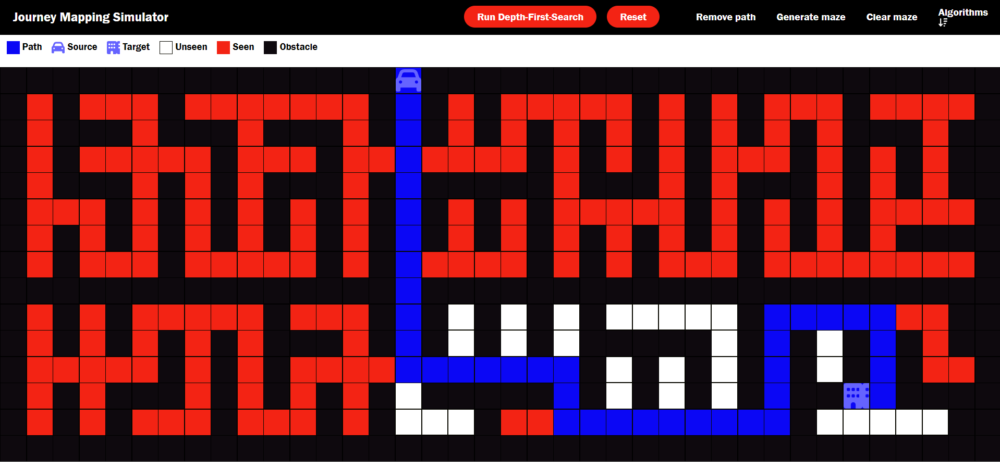
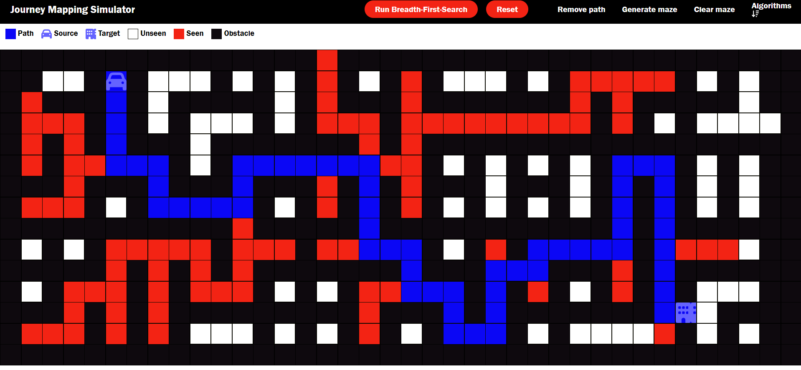
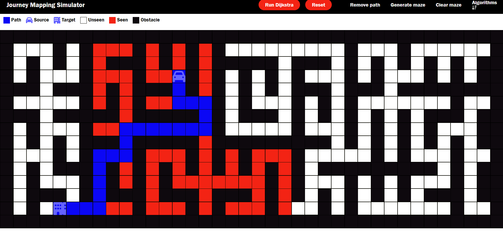

# Journey Mapping Simulator 🗺️
Deployment Link : https://journey-mapping-simulator-lakshayni09.netlify.app/

A web-based pathfinding visualization tool that demonstrates various graph traversal algorithms including Depth-First Search, Breadth-First Search, and Dijkstra's algorithm. Users can interactively create mazes, place start/end points, and visualize how different pathfinding algorithms work.


## 🌟 Features

- **Multiple Pathfinding Algorithms:**
  - Depth-First Search (DFS)

  - Breadth-First Search (BFS)

  - Dijkstra's Algorithm


- **Interactive Grid:**
  - Drag and drop start/end points
  - Click and drag to create walls/obstacles
  - Dynamic grid sizing based on viewport
  - Clear path and board options

- **Maze Generation:**
  - Automated maze generation using recursive division
  - Animated wall creation

- **Real-time Visualization:**
  - Color-coded cell states
  - Animated path discovery
  - Visualized visited nodes

## 🚀 Getting Started

### Prerequisites
- A modern web browser
- No additional dependencies required

### Installation

1. Clone the repository:
```bash
git clone https://github.com/yourusername/journey-mapping-simulator.git
```

2. Navigate to the project directory:
```bash
cd journey-mapping-simulator
```

3. Open `index.html` in your web browser.

## 🎮 How to Use

1. **Select Algorithm:**
   - Click the "Algorithms" dropdown
   - Choose between DFS, BFS, or Dijkstra's algorithm

2. **Create Maze:**
   - Click and drag to draw walls
   - Use "Generate maze" for automatic maze creation
   - Use "Clear maze" to remove all walls

3. **Set Points:**
   - Drag the source (start) and target (end) points to desired locations

4. **Visualize:**
   - Click "Start" to begin the visualization
   - Use "Remove path" to clear the current path while keeping walls
   - Use "Reset" to return to initial state

## 🎨 Visual Guide

- 🟦 Path: Final route from start to end
- 🟢 Source: Starting point
- 🔴 Target: Destination point
- ⬜ Unseen: Unvisited cells
- 🟨 Seen: Visited cells during algorithm execution
- ⬛ Obstacle: Walls/barriers

## 🛠️ Technical Implementation

### Core Components

- **Grid System:**
  - Dynamically sized grid using CSS Grid
  - Responsive design with viewport adjustments
  - Cell-based interaction system

- **Algorithm Implementation:**
  - Modular algorithm design
  - Priority Queue implementation for Dijkstra's
  - Path reconstruction using parent mapping

- **Animation System:**
  - Custom CSS animations for:
    - Path discovery
    - Wall creation
    - Node visiting

### File Structure

```
journey-mapping-simulator/
├── index.html
├── index.css
├── algo.js
└── assets/
    ├── start.svg
    ├── end.svg
    └── down-arrow.svg
```

## 🤝 Contributing

Contributions are welcome! Please feel free to submit a Pull Request.

1. Fork the project
2. Create your feature branch (`git checkout -b feature/AmazingFeature`)
3. Commit your changes (`git commit -m 'Add some AmazingFeature'`)
4. Push to the branch (`git push origin feature/AmazingFeature`)
5. Open a Pull Request

## 🙏 Acknowledgments

- Inspired by pathfinding visualizers and maze generation algorithms
